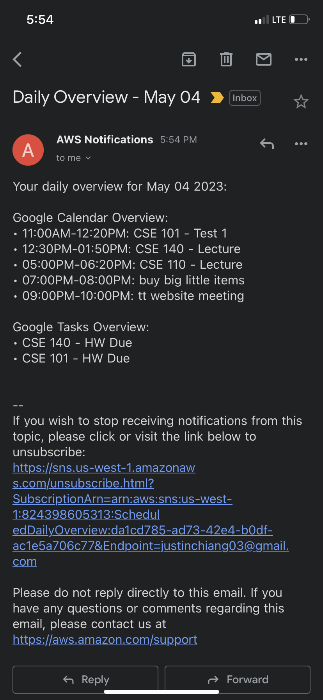

# Google Morning Overview

Python script for fetching daily events and tasks from Google Calendar/Tasks and formatting information in a brief overview. Implemented to run as a scheduled job to run daily at 8am.

Built using Python with Google Calendar/Tasks APIs, AWS SNS and deployed using Docker and AWS ECS.

